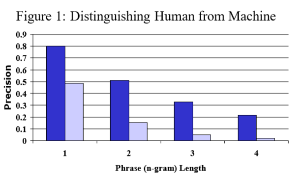
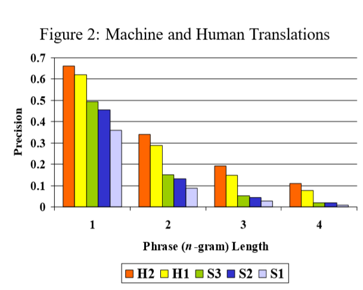

上半年的时候就已经看到 [The GEM Benchmark](https://arxiv.org/abs/2102.01672) 这篇论文。当时就想着写点什么记录一下，但是一直找不到时间来写。总拖着也不好，现在就把之前零零散散记录的内容整理出来吧。

这篇先简单介绍一下文本生成的评价指标，下一篇再详细介绍 [The GEM Benchmark](https://arxiv.org/abs/2102.01672) 的做法。


衡量生成文本的质量是文本生成评价指标设计的初衷，但是对生成文本的质量进行评价是一个非常主观的过程。而且目前还没有一个完美的客观评价指标，这就导致文本生成的论文很多都需要使用人工评价来证明自己取得了很好的效果。  
文本生成的评价指标主要分为客观评价指标和人工评价。这里主要聊下客观评价指标。


## BLEU

[BLEU: a Method for Automatic Evaluation of Machine Translation](https://www.researchgate.net/publication/2588204_BLEU_a_Method_for_Automatic_Evaluation_of_Machine_Translation) 是2002年 IBM 提出的论文。而这篇论文设计的初衷是设计一种简单、快速、低成本的方法替代人工评价。  
BLEU最开始是用在机器翻译的任务中，主要是用来计算参考译文和候选译文中 n-gram 的重叠程度（n-gram precision）。这一设计的灵感来自于语音识别（ASR）任务的字错误率(word  error rate)，这样导致 BLEU 允许生成文本在单词选择和词序上存在一定的差异（论文的说法是合理性差异 legitimate difference）。  

以论文中的例子来说：

```txt
Example 1:
candidate 1: It is a guide to action which ensures that the military alwarys obeys the commands of the party.
candidate 2: It is to insure the troops forever hearing the activity fuidebook that party direct.
reference 1: It is a guide to action that ensures that the military will forever heed Party commands.
reference 2: It is the guiding principle which guarantees the military forces always being under the command of the Party.
reference 3: It is the practical guide for the army always to heed the directions of the party.

Example 2:
candidate: the the the the the the the.
reference 1: The cat is on the mat.
reference 2: There is a cat on the mat.
```

好的生成文本通常跟参考文本有很多相同的词（word）和短语（phrase）。
比如例子1中，备选句子1相比备选句子2而言包括更多相同的部分。
因此，可以对相同部分的程度进行量化，从而对生成文本进行评价。  
  
BLEU 的主要任务是比较候选文本（candidate）和参考文本(reference)的 n-gram 匹配次数。
匹配次数越多，说明候选翻译越好。
BLEU 计算的基础是计算精确度（precision），
用候选文本和参考文本中共同出现 unigram 的数量除以候选文本中 unigram 的数量。
  
但是这样也会产生一个问题，可能存在高精度但是实际效果很差的文本，如例子2所示。 
 BLEU 解决这个问题的方案（modified unigram precision）就是将每个参考文本中匹配过的词去掉，不进行下一次匹配。
计算时，首先统计每个 n-gram 在单个参考文本的最大出现次数。
然后在计算候选文本和参考文本 n-gram 匹配次数时，将最大值设置为之前统计的最大次数，即
$Count_{clip} = min(Count, Max_Ref_Count)$。
最后除以所有参考文本文本 n-gram 的总数量。
  
$$p_n = \frac{\sum_{C \in \{Candidates\}}\sum_{n-gram \in C} Count_{clip}(n\mbox{-}gram)}{\sum_{C' \in {\{Candidates\}}} \sum_{n\mbox{-}gram' \in C'}{Count(n\mbox{-}gram')} }$$
  
论文对两个效果差异很大的两个翻译系统在相同条件（127条源文本、每条4个参考翻译）下进行比较，统计平均得分。
如下图所示，modified n-gram precision 可以很好的区分翻译系统的优劣。
  

  
论文还对 n-gram 的取值进行了实验，在相同的实验条件（两个人工翻译、三个机器翻译系统）下，
依旧保持了不错的区分性，并且在 n-gram 的取值上都包含足够的信息。
为此论文选择对其进行加权平均，即兼顾了随着 n-gram 增加修正精确度区分度的衰减
（modified unigram precision 远大于 modified bigram precision，
modified bigram precision 又远大于 modified trigram precision），
又考虑到了各个取值上包含的信息。
  

  
虽然 modified n-gram precision 可以惩罚没有出现在参考文本中的 n-gram，
并且限制一个 n-gram 的统计次数（最大值限制为单个参考文本最大出现次数），
但是依然没有办法强制限制翻译文本的长度。
  
通常可以靠精确率（precision）和召回率（recall）相结合来实现对文本长度的限制。
但是 BLEU 考虑的是多条参考翻译，
每个参考翻译都有可能使用不同的词来对源文本中对应的词进行翻译。
因此，一个好的参考翻译只会贴近其中一个可能性，而不是全部。
在所有的参考翻译上进行召回率计算不能保证分数可以评价参考文本质量的好坏。
  
过长的文本会被 modified n-gram precision 惩罚，
因此没必要对过长的文本进行进一步处理。
因此需要引入一个简洁惩罚（brevity penalty）来防止产生过短的文本。
这种简洁惩罚和 modified n-gram precision 都没有直接考虑源文本长度，
而是考虑参考翻译文本长的范围。
当翻译的长度与任务参考翻译的长度相同的时候将简洁惩罚设置为1.0。
具体计算如下：
  
$$\mathrm{BP}=\left\{\begin{array}{ll}
1 & \text { if } c>r \\
e^{(1-r / c)} & \text { if } c \leq r
\end{array}\right.$$
  
$$\mathrm{BLEU}=\mathrm{BP} \cdot \exp \left(\sum_{n=1}^{N} w_{n} \log p_{n}\right)$$
  
$$\log \mathrm{BLEU}=\min \left(1-\frac{r}{c}, 0\right)+\sum_{n=1}^{N} w_{n} \log p_{n}$$
  
通常情况下N取值为4，权重值设置为 $w_n = 1/N$ 。


## ROUGE

[ROUGE](https://aclanthology.org/W04-1013/) 是针对摘要任务提出的一种评测方法，
通过统计参考摘要和候选摘要在 n-gram 、序列（word sequences）、字对（word pair）的重叠（overlap）程度来评价候选摘要的质量。
论文总共提出了四种 ROUGE 计算方案，分别是 ROUGE-N 、 ROUGE-L 、 ROUGE-W 、 ROUGE-S 。
接下来就分别介绍一下这四种 ROUGE 计算方案。


### ROUGE-N: N-gram Co-Occurrence Statistics

ROUGE-N 的计算公式如下，用来统计候选摘要集合和参考摘要在 n-gram 上的召回率。
  
$$\mathrm{ROUGE-N}=\frac{\sum_{\mathrm{S}\in\{\mathrm{ReferenceSummaries}\}} \sum_{\mathrm{gram}_n \in \mathrm{S}}{\mathrm{Count}_{\mathrm{match}}{(\mathrm{gram}_n)}}}{\sum_{\mathrm{S}\in\{\mathrm{ReferenceSummaries}\}} \sum_{\mathrm{gram}_n \in \mathrm{S}}{\mathrm{Count}{(\mathrm{gram}_n)}}}$$
  
与 BLEU 不同的是， $\mathrm{Count}_{\mathrm{match}}(\mathrm{gram}_n)$ 
用来计算一个候选摘要和参考摘要集合中 n-gram 的最大共现次数。
另外， BLEU 是一个基于精确度的度量， ROUGE-N 是基于召回率的度量。
  
当参考摘要包含多条时，计算公式如下所示：
  
$$\mathrm{ROUGE-N}_{\mathrm{multi}}=\mathrm{argmax}_i{\mathrm{ROUGE-N}(r_i, s)}$$
  
这一计算方法同样也可以应用在 ROUGE-L 、 ROUGE-W 、 ROUGE-S 中。
这里的计算使用了折裂过程（Jackknifing procedure），
将 M 个参考摘要拆分为 M 组 M-1 个摘要。
最终的 ROUGE-N 分数取 M 组参考摘要下 ROUGE-N 分数的平均值。
  

### ROUGE-L: Longest Common Subsequence

LCS(the longest common subsequence)指的是序列 X 和序列 Y 的最长公共子序列。 
LCS 通常用来识别平行语料中的同源候选词。
  
在摘要任务上使用 LCS ，需要将句子看作单词的序列，
两个摘要文本的最长公共子序列越长，两个摘要文本就越相近。
计算时，使用基于 LCS 的 F-measure 来评估参考摘要 X （长度为 m）和候选摘要 Y （长度为 n）的相似程度。
  
$$ \mathrm{R}_{\mathrm{lcs}}=\frac{\mathrm{LCS}(X, Y)}{m} $$
  
$$ \mathrm{P}_{\mathrm{lcs}}=\frac{\mathrm{LCS}(X, Y)}{n} $$
  
$$ \mathrm{F}_{\mathrm{lcs}}=\frac{(1+b^2)R_{lcs}P_{lcs}}{R_{lcs} + b^2 P_{lcs}} $$
  
Melamed 使用 unigram F-measure 取得了跟 BLEU 相近的结果。
使用 LCS 的一个有优点是不需要联系匹配，只需要按照顺序匹配。
而且也不需要预定 N 的长度。
LCS 的一个缺点是只计算主要序列的单词，
而其他等长序列或者非最长序列的信息不会反映在最终的得分中。
  
前面介绍了如何计算单个句子摘要基于 LCS 的 F-measure 。
当在处理多句摘要时，计算每个参考摘要( u 个)和所有候选摘要（ v 个）的 LCS ，再将其合并。
公式如下：
  
$$ R_{lcs}=\frac{\sum^u_{i=1}\mathrm{LCS}_{U}(r_i, C)}{m} $$
  
$$ R_{lcs}=\frac{\sum^u_{i=1}\mathrm{LCS}_{U}(r_i, C)}{n} $$
  
$$ F_{lcs}=\frac{(1+b^2)R_{lcs}P_{lcs}}{R_{lcs}+b^2P_{lcs}} $$
  
LCS 在计算句子对（S1 、S2）时， $\mathrm{LCS}(s_i, s_j)$ 的计算公式如下：
  
$$ \mathrm{LCS}(s_i, s_j)=\frac{\sum_{s_i \in S_1}{max_{s_j \in S_2}{\mathrm{LCS}(s_i, s_j)}} + \sum_{s_j \in S_2}{max_{s_i \in S_1}{\mathrm{LCS}(s_i, s_j)}}}{\sum_{s_i \in S_1}{\mathrm{length}(s_i)} + \sum_{s_j \in S_2}{\mathrm{length}(s_j)}} $$
  
当 S1 包括 m 个字， S2 包括 n 个字时，公式相当于：
  
$$ \mathrm{LCS}(s_i, s_j)=\frac{2*\sum_{s_i \in S_1}{max_{s_j \in S_2}{\mathrm{LCS}(s_i, s_j)}}}{m+n} $$
  
MEAD LCS 的召回率和精确率和 F-measure 定义如下：
  
$$ R_{lcs-MEAD}=\frac{\sum_{s_i \in S_1}{max_{s_j \in S_2}{\mathrm{LCS}(s_i, s_j)}}}{m} $$
  
$$ P_{lcs-MEAD}=\frac{\sum_{s_i \in S_1}{max_{s_j \in S_2}{\mathrm{LCS}(s_i, s_j)}}}{n} $$
  
$$ \mathrm{LCS}(S_1, S_2)_{MEAD}=\frac{(1+b^2)R_{lcs-MEAD}P_{lcs-MEAD}}{R_{lcs-MEAD} + b^2 P_{lcs-MEAD}} $$
  
ROUGE-L 和 LCS 在计算 F-measure 时，参数 $\beta$ 设置相同 $\beta=1$。
两者区别在于如何从句子中获取 LCS 分数，
 Normalized pairwise LCS  取最佳的 LCS 分数，
 ROUGE-L 则是选择合并 LCS 的分数。


### ROUGE-W: Weighted Longest Common Subsequence

相同的 ROUGE-L 分数的两个参考摘要质量也可能不同。
在 WLCS （Weighted LCS）中，将所有连续匹配长度保存到一个二维的动态规划表中。
  
$$ R_{wlcs}=f^{-1}(\frac{WLCS(X, Y)}{f(m)}) $$
  
$$ P_{wlcs}=f^{-1}(\frac{WLCS(X, Y)}{f(n)}) $$
  
$$ F_{wlcs}=\frac{(1+b^2)R_{wlcs}P_{wlcs}}{R_{wlcs} + b^2 P_{wlcs}} $$
  
权重方程使用$f(k)=k^2$

### ROUGE-S: Skip-Bigram Co-Occurrence Statistic
  
skip-bigram 是一种允许存在间隔的单词对组合。
比如句子：
```text
police killed the gunman.
```
可以形成的组合包括：
```text
"police killed", "police the", "police gunman", "killed the", "killed gunman", "the gunman"
```
skip-bigram-based F-measure 计算公式如下：
  
$$ R_{skip2}=\frac{\mathrm{SKIP2}(X, Y)}{\mathrm{C}(m, 2)} $$
  
$$ P_{skip2}=\frac{\mathrm{SKIP2}(X, Y)}{\mathrm{C}(n, 2)} $$
  
$$ F_{skip2}=\frac{(1+b^2)R_{skip2}P_{skip2}}{R_{skip2} + b^2 P_{skip2}} $$
  
ROUGE-S 的一个优势是不需要连续匹配但仍然对词序敏感。
但是在组成单词的组合时会产生无意义的组合，比如
```text
"the the", "of in"
```
这种组合不能形成有意义的词，但是在计算中还是会被计入。
为此可以限制最大跳过距离。
  
ROUGE-S 存在一个潜在的问题是如果有一个参考摘要与候选摘要没有任何相同的词组，
这样的计算结果与参考摘要没有任何单词的情况下， ROUGE-S 的分数都为0。
这是不合理的。
为此需要采用一定的方法将这两种情况区分开。
另外还需要将 S5 中没有相同词组 和 S1 中没有相同词组的情况区分开。
为此设计了 ROUGE-SU 。 
ROUGE-SU 在 ROUGE-S 的基础上，使用 unigram 作为计数单元，
并在候选摘要和参考摘要的开头增加一个句子起始标识。

  
论文中，作者经过一系列实验证明了 ROUGE 的效果，对此就不再赘述。
实验也表明： 
ROUGE-2 、 ROUGE-L 、ROUGE-W 和 ROUGE-S 在单文档摘要任务中表现良好；
ROUGE-1 、 ROUGE-L 、ROUGE-W 、 ROUGE-SU4 和 ROUGE-SU9 在非常短的摘要（标题生成）中表现良好；
ROUGE-2 、 ROUGE-S4 、ROUGE-S9 、ROUGE-SU4 和 ROUGE-SU9 在去除停用词后效果较好；
去除停用词通常回提高相关性；
使用多个参考文本回提高与人工评价的相关性。


以上就是 BLEU 和 ROUGE 这两个使用比较多的评价指标，
其余比如说困惑度之类的有时间再总结吧，摸了。

另外安利一下我编写的一个小工具[五艺](https://github.com/Moriarty12138/WuYi)。
当前已经支持 BLEU 和 ROUGE 的计算。后续还会继续更新功能。
