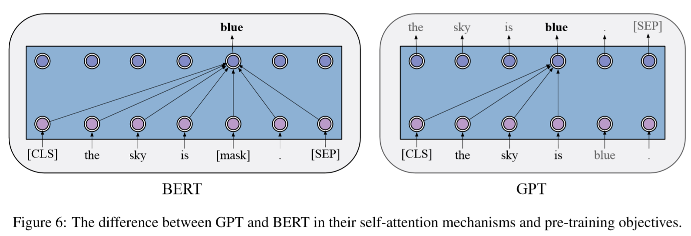
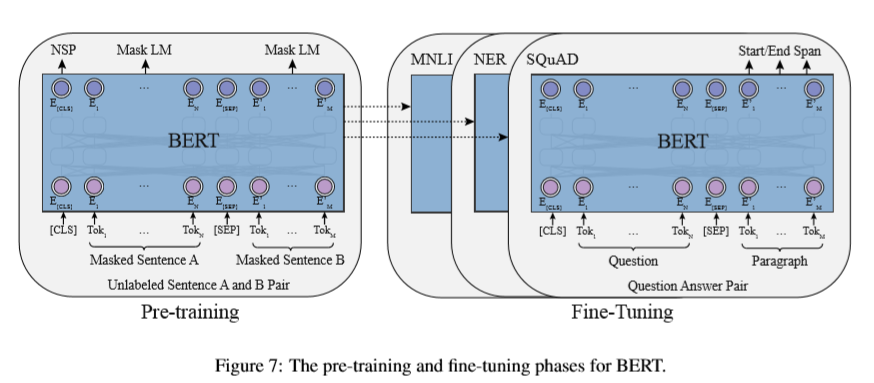

本来想总结一下自己对预训练模型的一些认识，但是我明显低估了这个任务的难度。
正好这段时间清华大学唐杰老师在微博上推了一个综述论文
[Pre-Trained Models: Past,Present and Future](http://keg.cs.tsinghua.edu.cn/jietang/publications/AIOPEN21-Han-et-al-Pre-Trained%20Models-%20Past,%20Present%20and%20Future.pdf) 。
就以这篇论文的笔记作为开始吧。

  
这是清华大学悟道团队出的一篇讲预训练的论文。
不得不说，这密密麻麻的作者和机构看起来就很唬人。

让我们跳过前面讲预训练发展历史的部分，直接看预训练语言模型。

# GPT 和 BERT

基于 Transformer 的预训练语言模型主要分为两个分支， GPT 和 BERT 。
前者使用自回归语言模型（autoregressive language modeling）作为预训练目标，
后者则使用了自编码语言模型（autoencoding language modeling）作为预训练目标。
一般而言， GPT 更擅长生成（NLG）任务， BERT 更擅长理解（NLU）任务。
  

  
GPT 的预训练也是跟自回归语言模型一致，根据先前的文本最大化当前词的条件概率。
在预训练之后通过微调（fine-tuning）适应下游任务。
输入文本通过 GPT 获取最后一层的表示（representation），将其经过额外的输出层得到下游任务目标。
  

  
BERT 的预训练则采用了另一个思路，通过当前字两侧的文本预测当前字的概率。
为此 BERT 采用了一个预训练任务 MLM （masked language modeling）。
通过使用 \[MASK\] 随机遮蔽文本中的字（token），然后在预训练时对其进行预测。
除此之外， BERT 还采用了 NSP （next sentence prediction）预训练任务，
在预训练时预测两个句子是否构成上下句关系。
在微调阶段，输入如果存在两个句子则使用 \[SEP\] 连接，输入文本开始需要加上 \[CLS\] ，
BERT 会给每个输入 token 输出一个表示，这个表示可以用于序列标注任务和问答任务。
\[CLS\] token 的表示可以看作整个句子的表示，将其通过一个额外的分类层就可以用于分类任务。
  
RoBERTa 对 BERT 做了一定的改进：
1. 去掉了 NSP 预训练任务（RoBEARTa 指出 BERT 不需要 NSP）
2. 使用了更大的 batch size ，更多的训练数据和更多的训练步数
3. 使用了更长的训练文本
4. 动态修改 \[MASK\]
  
ALBERT 则从减少参数量的角度改进了BERT：
1. 将输入 embedding 矩阵拆分为两个较小的矩阵
2. Transformer 各层之间共享参数
3. 使用句子顺序预测预训练任务（SOP）代替 NSP 
  
因为牺牲了空间效率， ALBERT 微调和推理的速度很慢。
  
