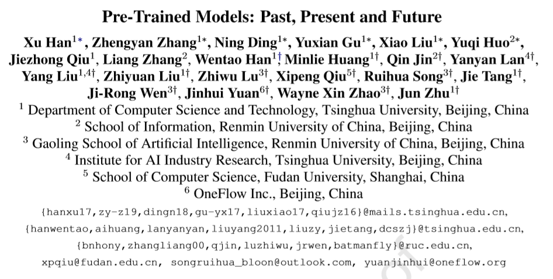

本来想总结一下自己对预训练模型的一些认识，但是我明显低估了这个任务的难度。
正好这段时间清华大学唐杰老师在微博上推了一个综述论文
[Pre-Trained Models: Past,Present and Future](http://keg.cs.tsinghua.edu.cn/jietang/publications/AIOPEN21-Han-et-al-Pre-Trained%20Models-%20Past,%20Present%20and%20Future.pdf) 。
就以这篇论文的笔记作为开始吧。

这是清华大学悟道团队出的一篇讲预训练的论文。
不得不说，这密密麻麻的作者和机构看起来就很唬人。

TODO