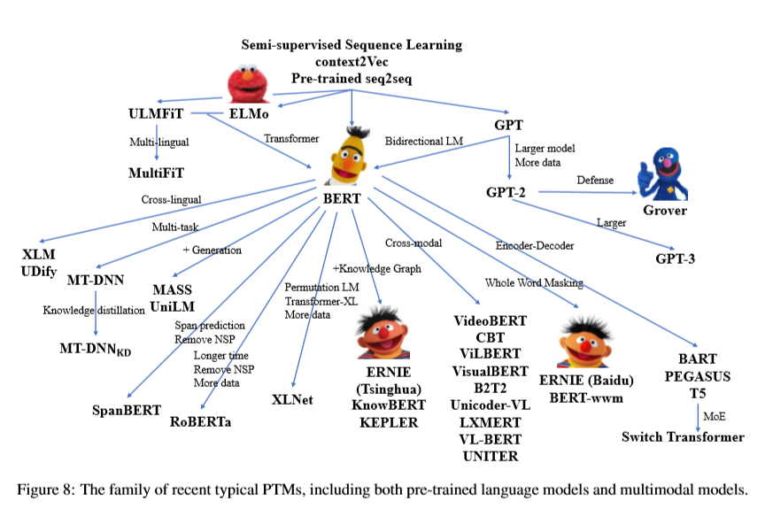
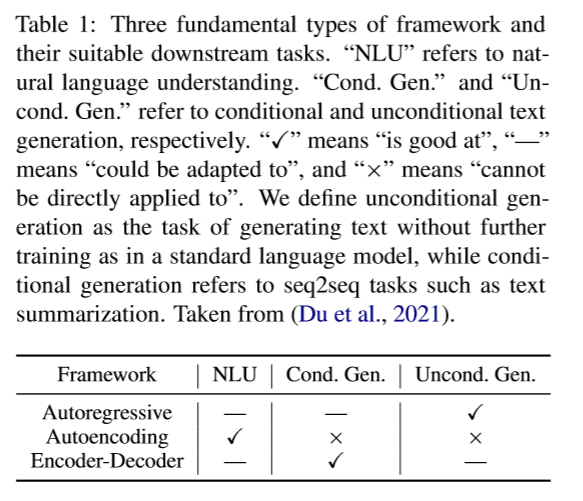

本来想总结一下自己对预训练模型的一些认识，但是我明显低估了这个任务的难度。
正好这段时间清华大学唐杰老师在微博上推了一个综述论文
[Pre-Trained Models: Past,Present and Future](http://keg.cs.tsinghua.edu.cn/jietang/publications/AIOPEN21-Han-et-al-Pre-Trained%20Models-%20Past,%20Present%20and%20Future.pdf) 。
就以这篇论文的笔记作为开始吧。

  
这是清华大学悟道团队出的一篇讲预训练的论文。
不得不说，这密密麻麻的作者和机构看起来就很唬人。

让我们跳过前面讲预训练发展历史的部分，直接看预训练语言模型。

# GPT 和 BERT

基于 Transformer 的预训练语言模型主要分为两个分支， GPT 和 BERT 。
前者使用自回归语言模型（autoregressive language modeling）作为预训练目标，
后者则使用了自编码语言模型（autoencoding language modeling）作为预训练目标。
一般而言， GPT 更擅长生成（NLG）任务， BERT 更擅长理解（NLU）任务。
  

  
GPT 的预训练也是跟自回归语言模型一致，根据先前的文本最大化当前词的条件概率。
在预训练之后通过微调（fine-tuning）适应下游任务。
输入文本通过 GPT 获取最后一层的表示（representation），将其经过额外的输出层得到下游任务目标。
  

  
BERT 的预训练则采用了另一个思路，通过当前字两侧的文本预测当前字的概率。
为此 BERT 采用了一个预训练任务 MLM （masked language modeling）。
通过使用 \[MASK\] 随机遮蔽文本中的字（token），然后在预训练时对其进行预测。
除此之外， BERT 还采用了 NSP （next sentence prediction）预训练任务，
在预训练时预测两个句子是否构成上下句关系。
在微调阶段，输入如果存在两个句子则使用 \[SEP\] 连接，输入文本开始需要加上 \[CLS\] ，
BERT 会给每个输入 token 输出一个表示，这个表示可以用于序列标注任务和问答任务。
\[CLS\] token 的表示可以看作整个句子的表示，将其通过一个额外的分类层就可以用于分类任务。
  
在此之后，RoBERTa 和 ALBERT 都对 BERT 做了一定的改进，其中 RoBERTa 对 BERT 的改进主要包括4点：
1. 去掉了 NSP 预训练任务（RoBEARTa 指出 BERT 不需要 NSP 这个预训练任务，不过最新的研究 NSP 任务还是很重要的）；
2. 使用了更大的 batch size ，更多的训练数据和更多的训练步数；
3. 使用了更长的训练文本；
4. 动态修改 \[MASK\] ；
  
而 ALBERT 则从减少参数量的角度改进了BERT：
1. 将输入 embedding 矩阵拆分为两个较小的矩阵；
2. Transformer 各层之间共享参数；
3. 使用句子顺序预测预训练任务（SOP）代替 NSP ；
  
因为牺牲了空间效率， ALBERT 微调和推理的速度很慢。
  
对于预训练语言模型的改进主要集中在以下几个方面：
1. 改进模型结构或者设计新的预训练任务（XLNet、UniLM、MASS、SpanBERT、ELECTRA）；
2. 尝试多语言版本、结合知识图谱或者多模态的预训练语言模型；
3. 扩大预训练语言模型的尺寸（GPT、Switch Transformer）的同时提高计算效率；
  
后面详细讲一下各个方面的改进。
  

  
# 模型结构上的改进
  
预训练语言模型在结构上的改进主要有两个目的，
一是希望能建立一个统一的预训练语言模型（unified sequence modeling），
另一个是 cognitive-inspired architectures。
除此之外，有些改进主要用于提高自然语言理解的任务。
  
## 统一语言建模方向的改进
  
XLNet 使用了置换语言建模（permutated language modeling）统一了 GPT 风格的单项语言生成和 BERT 风格的双向语言理解。
论文指出 BERT 在预训练时使用 \[MASK\] 遮蔽的策略，而下游任务却没有出现 \[MASK\] 。
这使得预训练任务和下游任务存在矛盾。
为此， XLNet 在做预训练时对字的顺序进行重新排序，然后采用自回归的范式进行预训练，这使得 XLNet 同时具有了理解和生成的能力。
  
MPNet 采用了跟 XLNet 一样的置换语言建模，同时弥补了 XLNet 在预训练时不知道句子长度而下游任务知道句子长度这一矛盾。
  
UniLM 则是从多种预训练任务的角度建立一个统一的预训练语言模型。
UniLM 联合训练了单向（unidirectional）、双向（bidirectional）和序列到序列（sequence-to-sequence）三种预训练任务。
之所以能实现这一操作，是因为 UniLM 在注意力计算时采用了 MASK 的策略。
UniLM 在生成问答和生成式摘要上取得了很好的效果。
  
GLM 采用了一个更加优雅的方式统一自回归和自编码。
GLM 选择文本中的一个片段进行 MASK ，并不像 BERT 和 SpanBERT 一样告诉模型 \[MASK\] 代表了多少个字（token），
并采用了二维位置编码的策略保存 \[MASK\] 的长度信息。
GLM是第一个在自然语言理解、条件生成和无条件生成等所有类型任务中同时实现最佳性能的模型。
  

  
Seq2Seq 结构最早的模型是 MASS ，MASS 将预测 MASK 的机制加入到编码解码结构中。
但是也没有解决用可变长度的文本填充空白的问题（GLM之前基于编码器或者解码器的预训练语言模型都存在这一问题）。
  
T5 则是通过 MASK 一个片段来解决这一问题。
  
BART 则是通过截断、删除、替换、打乱和 MASK 多个策略处理源文本。
在这一方向上针对具体任务的预训练语言模型包括 PEGASUS 和 PALM 。
  
基于 Seq2Seq 预训练语言模型主要问题是参数量更多，而且通常在 NLU 任务上表现不好。
  
## 受到认知影响的结构（Cognitive-Inspired Architectures）
  
这部分的工作主要在可维护的工作记忆（maintainable working memory）和可持续性长期记忆（sustainable long-term memory）方向。
maintainable working memory 方向的工作主要有 
Transformer-XL（ segment-level recurrence 和相对位置编码）、 
CogQA（在多跳阅读中维持一个认知图）、 
CogLTX（使用 MenRecall 模型选择句子，并用另一个模型生成或选择答案）。
sustainable long-term memory 方向的工作主要有 REALM、RAG。
前者通过样本维度的记忆提升长距离理解能力，后者则是信息提前编码，
再通过检索获取需要的信息。
  
## 其他方向
  
其他方向的改进主要集中在 MASK 策略上，
Span-BERT 提出的 SBO （span boundary objective） 预训练任务的思路在 ERNIE、 NEZHA 和 Whole Word Masking 上都有体现（这可以被看作是一种数据增强）。
  
另一种则是将预测 MASK 的任务目标改的更加困难，比如 ELECTRA 的 RTD（replace token detection）
需要一个生成器生成原始 token ，一个判别器判断 token 是否被替换。
  
# 多源数据
  
这部分的研究主要在跨语言、多模态和融合知识信息上。
  
## 跨语言
  
在 BERT 出现之前，跨语言模型主要通过参数共享和学习语言无关的约束两个方式学习到跨语言的参数表示。
在 BERT 出现之后，模型可以直接在多跨语言非平行语料上进行预训练。
mBERT 在模型结构没有变得情况下，使用104种语言的 Wikipedia 语料库上进行了预训练。
XLM-R 构建了一个100种语言的非平行语料库 CC-100 。
  
MMLM（multilingual masked language）预训练任务不能很好的适应平行预料，
但是对于翻译任务来说平行语料又非常的重要。
为此 XLM 提出了 TLM（translation language modeling） 预训练任务，
在双语句子对上进行预训练。
除此之外，Unicoder 提出了两种预训练任务 CLWR 和 CLPC ；
ALM 通过平行语料基于代码生成文本，然后在此基础上进行 MLM 预训练任务。
InfoXLM 从信息论的角度对 MMLM 和 TLM 进行了分析，使用对比学习进行训练。
HICTL 拓展了使用对比学习让模型学习句子级和单词级语义表征的想法。
ERNIE-M 提出了 BTMLM（back-translation masked language） 利用反译拓展了平行语料库的规模。
  
在 Seq2Seq 结构的预训练语言模型中， mBART 通过添加特殊符号使得 DAE（denoising autoencoding） 支持多语言；
XNLG 则是提出了 XAE（cross-lingual autoencoding） 训练任务。
  
## 多模态
  
图像-文本的跨模态语言模型的主要难点在于如何将非文本信息集成到 BERT 框架中。
ViLBERT 通过对图像和文本数据进行预处理，
将 BERT 拓展为支持两个输入流的图像和文本的多模态模型。
它使用三个预训练任务：MLM、 SIA（sentence-image alignment） 和 MRC（masked region classification）。
下游任务包括五个： VQA（visual question answering）、 GRE（grounding referring expressions）、
ITIR（image-text retrieval）、 ZSIR（zero-shot imagetext retrieval）。
LXMERT 在 ViLBERT 的基础上使用了更多的与训练任务： MLM 、 SIA、 MRC、MRFR（masked region feature regression） 和 VQA 。
LXMERT 的下游任务只有三个： VQA、 GQA（graph question answering） 和 NLVR2（natural language for visual reasoning）。
  
