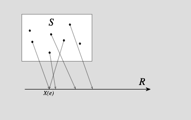

## 隐马尔可夫模型（HMM） 

### 什么是隐马尔可夫模型？

首先需要了解一下什么是随机变量。

> 给定样本空间$(S, F)$ ，如果其上的实值函数$X:S\rightarrow R$ 是$F$ （实值）可测函数，则称$X$ 为（实值）**随机变量**。初等概率论中通常不涉及可测性的概念，而直接把任何$X:S\rightarrow R$ 称为随机变量。
>
> 
>
> 如果$X$ 指定给概率空间$S$ 中每一个事件$e$ 有一个实数$X(e)$ ，同时针对每一个实数$r$都有一个事件集合$A_r$ 与其相对应，其中$A_r=\{e:X(e)\le r\}$ ，那么 $X$ 被称为随机变量。随机变量一般用大写拉丁字母或者小写希腊字母（比如$X$，$Y$，$X$，$Z$，$\xi$，$\eta$）来表示，从上面的定义注意到，随机变量实质上是函数。称其为变量是指可作为因变量。

维基百科上的解释就已经足够详尽。实际上随机变量可以看作是一个可以作为变量的函数。

知道了随机变量之后，还需要了解一下随机过程。

> 在[概率论](https://zh.wikipedia.org/wiki/機率論)中，**随机过程**（英语：Stochastic process）是[随机变量](https://zh.wikipedia.org/wiki/隨機變數)的[集合](https://zh.wikipedia.org/wiki/集合_(数学))。若一[随机系统](https://zh.wikipedia.org/w/index.php?title=随机系统&action=edit&redlink=1)的[样本点](https://zh.wikipedia.org/wiki/样本点)是随机函数，则称此函数为样本函数，这一随机系统全部样本函数的集合是一个**随机过程**。实际应用中，样本函数的一般定义在[时间域](https://zh.wikipedia.org/wiki/时间域)或者[空间域](https://zh.wikipedia.org/w/index.php?title=空间域&action=edit&redlink=1)。随机过程的实例如[股票](https://zh.wikipedia.org/wiki/股票)和[汇率](https://zh.wikipedia.org/wiki/汇率)的波动、[语音信号](https://zh.wikipedia.org/w/index.php?title=语音信号&action=edit&redlink=1)、[视频信号](https://zh.wikipedia.org/w/index.php?title=视频信号&action=edit&redlink=1)、[体温](https://zh.wikipedia.org/wiki/體溫)的变化，随机运动如[布朗运动](https://zh.wikipedia.org/wiki/布朗运动)、[随机徘徊](https://zh.wikipedia.org/wiki/随机徘徊)等等。

意思就是在时间或者空间角度，一个定义于概率空间的随机变量变化的集合。

详细定义如下：

> 设$(\Omega,F,P)$ 为一概率空间，另设集合$T$为一指标集合。如果对于所有的$t\in T$ ，均有一随机变量$\xi_t(w)$ 定义于概率空间$(\Omega,F,P)$ ，则集合$\{\xi_t(w)|t\in T\}$ 为一随机过程。

知道了随机过程之后就可以理解马尔可夫链了。马尔可夫链实际上是一种随机过程。相比较其他随机过程，马尔科夫链假设下一状态的概率分布只能由当前状态决定。

> **马尔可夫链**（英语：Markov chain），又称**离散时间马尔可夫链**（discrete-time Markov chain，缩写为**DTMC**），因俄国数学家[安德烈·马尔可夫](https://zh.wikipedia.org/wiki/马尔可夫)得名，为[状态空间](https://zh.wikipedia.org/wiki/狀態空間_(計算機科學))中经过从一个状态到另一个状态的转换的[随机过程](https://zh.wikipedia.org/wiki/随机过程)。该过程要求具备“无记忆”的性质：下一状态的概率分布只能由当前状态决定，在时间序列中它前面的事件均与之无关。这种特定类型的“无记忆性”称作[马尔可夫性质](https://zh.wikipedia.org/wiki/馬可夫性質)。马尔科夫链作为实际过程的统计模型具有许多应用。
>
> 在马尔可夫链的每一步，系统根据概率分布，可以从一个状态变到另一个状态，也可以保持当前状态。状态的改变叫做转移，与不同的状态改变相关的概率叫做转移概率。[随机漫步](https://zh.wikipedia.org/wiki/随机漫步)就是马尔可夫链的例子。随机漫步中每一步的状态是在图形中的点，每一步可以移动到任何一个相邻的点，在这里移动到每一个点的概率都是相同的（无论之前漫步路径是如何的）。
>
> 马尔可夫链是离散状态、离散时间的马尔可夫过程。

在明白马尔可夫链之后就可以理解马尔可夫模型和隐马尔可夫模型。

> **隐马尔可夫模型**（Hidden Markov Model；[缩写](https://zh.wikipedia.org/wiki/縮寫)：**HMM**）或称作**隐性马尔可夫模型**，是[统计](https://zh.wikipedia.org/wiki/统计)[模型](https://zh.wikipedia.org/wiki/模型)，它用来描述一个含有隐含未知参数的[马尔可夫过程](https://zh.wikipedia.org/wiki/马尔可夫过程)。其难点是从可观察的参数中确定该过程的隐含参数。然后利用这些参数来作进一步的分析，例如[模式识别](https://zh.wikipedia.org/wiki/模式识别)。
>
> 在**正常的**马尔可夫模型中，状态对于观察者来说是直接可见的。这样状态的转换概率便是全部的参数。而在隐马尔可夫模型中，状态并不是直接可见的，但受状态影响的某些变量则是可见的。每一个状态在可能输出的符号上都有一[概率分布](https://zh.wikipedia.org/wiki/概率分布)。因此输出符号的序列能够透露出状态序列的一些信息。

隐马尔可夫模型是关于**时序**的概率模型，描述由一个**隐藏的马尔可夫链**随机生成**不可观测的状态随机序列**，再由各个状态生成一个观测而产生**观测随机序列**的过程。隐藏的马尔可夫链随机生成的随机生成的状态的序列，称为**状态序列**（state sequence）；每个状态生成一个观测，而由此产生的观测的随机序列，称为**观测序列**（observation sequence）。序列的每一个位置又可以看作是一个时刻。

### HMM的三要素

隐马尔可夫模型由**初始概率分布**、**状态转移概率分布**以及**观测概率分布**确定。隐马尔可夫模型的形式定于如下：

设$Q$是所有可能的状态的集合，$V$是所有可能的观测的集合。
$$
Q=\{i_1,i_2,...,i_T\},  O=\{o_1,o_2,...,o_T\}
$$
$A$是状态转移概率矩阵：
$$
A=[a_{ij}]_{N\times N}
$$
其中，
$$
a_{ij}=P(i_{t+1}=q_j|i_t=q_i),   i=1,2,...,N;j=1,2,...,N
$$
是在时刻$t$处于状态$q_i$的条件下在时刻$t+1$转移到状态$q_j$的概率。

$B$是观测概率矩阵：
$$
B=[b_j(k)]_{N \times M}
$$
其中，
$$
b_j(k)=P(o_t=v_k|i_t=q_j), k=1,2,...,M;j=1,2,...,N
$$
是在时刻$t$处于状态$q_j $的条件下生成观测$v_k$的概率。

$\pi$是初始状态概率向量：
$$
\pi=(\pi_i)
$$
其中，
$$
\pi_i=P(i_1=q_1), i=1,2,...,N
$$
是时刻$t=1$处于状态$q_i $的概率。

隐马尔可夫模型由初始状态概率向量$ \pi $、状态转移概率矩阵$A$和观测概率矩阵$B$决定，$ \pi $和$A$决定状态序列，$B$决定观测序列，因此隐马尔可夫模型$ \lambda $可以用三元符号表示，即
$$
\lambda = (A, B, \pi )
$$
$A$，$B$，$ \pi $称为隐马尔可夫模型的**三要素**。

状态转移概率矩阵$A$与初始状态转移概率矩阵$ \pi $确定了隐藏的马尔可夫链，生成不可观测的状态序列。观测概率矩阵$B$确定了如何从状态生成观测，与状态序列综合确定了如何产生观测序列。

### HMM的两大假设

HMM包含两大假设：

1. **齐次马尔可夫性假设**，即假设隐藏马尔可夫链在任意时刻$t$的状态只依赖于前一时刻的状态，与其他时刻的状态及观测无关，也与时刻$t$无关。
   $$
   P(i_t|i_{t-1},o_{t-1},...,i_1,o_1)=P(i_t|i_{t-1}), t=1,2,...,T
   $$

2. **观测独立性假设**，即假设任意时刻的观测只依赖于该时刻的马尔可夫链的状态，与其他观测及状态无关。
   $$
   P(o_t|i_T,o_T,i_{T-1},o_{T-1},...,i_{t+1},o_{t+1},i_t,i_{t-1},o_{t-1},...,i_1,o_1)=P(o_t|i_t)
   $$

隐马尔可夫模型可以用于标注，这时状态对应着标记。

### HMM的三个基本问题

隐马尔可夫有三个基本问题：

1. **概率计算问题**：给定模型$\lambda = (A, B, \pi )$和观测序列$O=(o_1,o_2,...,o_T)$，计算在模型$\lambda$下观测概率$O$出现的概率$P(O|\lambda)$。
2. **学习问题**：已知观测概率$O=(o_1,o_2,...,o_T)$，估计模型$\lambda = (A, B, \pi )$参数，使得在该模型下观测序列概率$P(O|\lambda )$最大。即用极大似然估计的方法估计参数。
3. **预测问题**，也称为解码（decoding）问题：已知模型$\lambda = (A, B, \pi )$和观测序列$O=(o_1,o_2,...,o_T)$，求对给定观测序列条件概率$P(I|O)$最大的状态序列$I=(i_1,i_2,...,i_T)$。即给定观测序列，求最有可能的状态序列。

#### 概率计算问题

如果正常计算概率，需要计算每个可能的状态的概率，再在此基础上计算每个状态生成已知观测的概率：
$$
P(O|\lambda)=\sum_I P(O|I,\lambda)P(I|\lambda)=\sum_{i_1,i_2,...,i_T}\pi_{i_1}b_{i_1}(o_1)a_{i_1,i_2}b_{i_2}(o_2)...a_{i_{T-1},i_T}b_{i_T}(o_T)
$$
这样的算法计算量是$O(TN^T)$阶的。为此需要对计算过程进行一定的简化。通常使用的是前向-后向算法。

**前向概率**：给定隐马尔可夫模型$\lambda $，定义到**时刻$t$部分**观测序列为$o_1, o_2, ...,o_t$且状态为$q_t$的概率为前向概率（是当前时刻$i_T=q_i$且观测序列为$o_1,o_2,...,o_t$的联合概率），记作
$$
\alpha_t(i)=P(o_1,o_2,...,o_t,i_t=q_i|\lambda)
$$
可以递推地求得前向概率$\alpha_t(i)$及观测序列概率$P(O| \lambda)$。

之所以前向算法计算能够简化计算，主要原因还是将一些重复的计算保存为一个一个前向概率。而在计算每个时刻的概率时可以直接使用前一时刻的计算值。这样计算量下降为$O(N^2T)$。

递推公式为：
$$
\alpha_{t+1}(i)=[\sum_{j=1}^{N}\alpha_t(j)a_{ji}]b_i(o_{t+1}), i=1,2,...,N
$$

**后向概率**：给定隐马尔可夫模型$\lambda $，定义到**时刻$t+1$到$T$时刻部分**观测序列为$o_{t+1}, o_{t+2}, ...,o_{T}$且在时刻$t$状态为$q_t$的概率为前向概率（是当前时刻$i_T=q_i$且观测序列为的联合概率），$o_{t+1}, o_{t+2}, ...,o_{T}$记作
$$
\beta_t(i)=P(o_{t+1},o_{t+2},...,o_T,i_t=q_i|\lambda)
$$
可以递推地求得前向概率$\beta_t(i)$及观测序列概率$P(O| \lambda)$。

同样，后向算法将后续计算过程保存为后向概率。通过前向概率和后向概率的定义可以将观测序列概率$P(O|\lambda)$可以转换为：
$$
P(O|\lambda)=\sum_{i=1}^{N}\sum_{j=1}^{N}\alpha_t(i)a_{ij}b_j(o_{t+1})\beta_{t+1}(j)
$$
代表了所有$t$时刻和$t+1$时刻之间所有状态的转换。去掉状态的转换，也可以表示为：
$$
P(O|\lambda)=\sum_{j=1}^{N}\alpha_t(j)\beta_t(j)
$$
特殊情况，当$t=1$时，
$$
P(O|\lambda)=\sum_{i=1}^{N}\alpha_T(i)
$$
当$t=T$时，
$$
P(O|\lambda)=\sum_{i=1}^{N}\pi_ib_i(o_1)\beta_1(i)
$$

因此根据前向概率和后向概率，可以简单表示出$t$时刻状态为$q_i$的概率：
$$
\gamma_t(i)=P(i=q_i|O,\lambda)=\frac{P(i=q_i,O|\lambda)}{P(O|\lambda)}=\frac{\alpha_t(i)\beta_t(i)}{\sum_{j=1}^{N}\alpha_t(i)\beta_t(i)}
$$
同样也可以表示出相邻时刻状态（$t$时刻状态为$q_i$，$t+1$时刻状态为$q_j$）的概率：
$$
\xi_t(i,j)=P(i_t=q_i,i_{t+1}=q_j|O,\lambda)=\frac{P(i_t=q_i,i_{t+1}=q_j,O|\lambda)}{P(O|\lambda)}=\frac{\alpha_t(i)a_{ij}b_j(o_{t+1})\beta_{t+1}(j)}{\sum_{i=1}^{N}\sum_{j=1}^{N}\alpha_t(i)a_{ij}b_j(o_{t+1})\beta_{t+1}(j)}
$$
根据上两个公式可以得出在观测$O$下状态$i$出现的期望值为$\sum_{t=1}^{T}\gamma_t(i)$；由状态$i$转移的期望值为$\sum_{t=1}^{T-1}\gamma_t(i)$；由状态$i$转移到状态$j$的期望值为$\sum_{t=1}^{T-1}\xi_t(i,j)$。

#### 学习问题

隐马尔可夫模型的学习问题根据训练数据中是否包含状态序列（有标注数据）分为监督学习和非监督学习。监督学习任务只需要根据训练数据统计各个初始状态频率、状态转移频率和各个状态下观测产生频率作为隐马尔可夫模型的参数值即可完成训练。非监督学习则需要借助EM算法进行计算。

##### EM算法

#### 预测问题

## CRF

